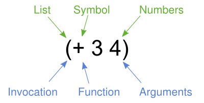

class: center, middle, nonum
# Introdução a Lisp em 30 minutos


### Introdução a Clojure, Projeto NuFtuturo, UFCG/Nubank<br>
©2023 Dalton Serey, UFCG

---
# Brevíssimo histórico

.bblue[Lisp] = .bblue[Lis].bgreen[t] .bblue[P].bgreen[rocessor]
… por que _processador de _listas_?! 🤔

- o foco da computação da época era a .bred[computação numérica]
- Lisp, contudo, foi criada para fazer .bblue[computação simbólica]
- a ideia era suportar a IA e criar programas que
  - fazem provas de teoremas matemáticos
  - resolvem passo a passo problemas de natureza algébrica
  - compreendem e produzem texto em linguagem natural 
- .bgreen[John McCarthy] percebeu o que havia em
  comum entre esses dados: todos podem ser vistos como .bblue[listas de símbolos]

???

Antes de apresentar a linguagem propriamente dita, me parece
importante entender, ainda que de forma simplificada, o que é
Lisp, a que se propõe e o contexto histórico em que foi criada.

Lisp significa literalmente "processador de listas" (o nome é, de
fato, acrônimo da expressão em inglês para isso). A questão que
qualquer programador moderno se faz é: "mas por quê listas?".
Afinal, qualquer LP moderna é capaz de processar listas.

A resposta pra pergunta está relacionada ao momento histórico em
que Lisp foi criada, em torno de 1958. Naquele momento, a
computação era voltada quase que exclusivamente para a computação
numérica, focando em aplicações militares, de engenharia ou
científicas que requeriam achar a solução de equações e sistemas
de equações com enormes quantidades de cálculos. O computador era
essencialmente uma supercalculadora. Por consequência, as
linguagens de programação, que estavam apenas começando a surgir
na época, eram voltadas pra atender a esse propósito. Lisp,
contudo, foi criada por John McCarthy com um propósito
significativamente diferente da computação numérica. A ideia era
uma linguagem que permitisse criar programas de IA (termo que ele
criou, por sinal) que, tipicamente, precisam processar expressões
simbólicas. O exemplo mais icônico desse tipo de aplicação são os
provadores de teoremas. Vários tipos de problemas humanos lidam
com a manipulação de dados simbólicos, por exemplo:

- expressões aritméticas, algébricas, analíticas, etc;
- fórmulas lógicas (em qualquer lógica);
- frases e textos em linguagem natural;
- argumentos lógicos conectando fórmulas lógicas;
- até manipulação de código em linguagens de programação.

Foi John McCarthy que percebeu que todas essas aplicações têm
isso em comum: todas podem ser vistas como processamento de
expressões simbólicas (sequências ou listas de símbolos). Lisp
foi criada para esse propósito.

---
class: greenbar
# Código Lisp

Antes de começarmos, vale a pena olhar algum código Lisp. De um
lado, não é tão diferente de código como Python: linguagem
sucinta, que prioriza múltiplas, pequenas funções. De outro, a
sintaxe é estranha com parênteses usados de forma estranha.
Talvez até pareça sem sentido à primeira vista.

Código da biblioteca padrão Clojure:
<a href="https://github.com/clojure/clojure/blob/master/src/clj/clojure/string.clj" target="_blank">String</a>,
<a href="https://github.com/clojure/clojure/blob/master/src/clj/clojure/math.clj" target="_blank">Math</a>,
e
<a href="https://github.com/clojure/clojure/tree/master/src/clj/clojure" target="_blank">outras</a>.

> O código da biblioteca padrão é excelente. Muito bem escrito,
> comentado, com documentação interna e bastante consistente em
> termos de estilo. É boa prática estudá-lo.

---
# Como estudar Lisp?

É boa ideia encarar LPs como ferramentas para _pensar_ e
_organizar_ ideias sobre _processos_ ao invés de vê-las como
meros mecanismos para instruir computadores a executarem tarefas.
Tipicamente, LPs proporcionam mecanismos de 3 tipos para isso:

1. .bblue[expressões primitivas] que permitem expressar as
   entidades mais simples com as quais a linguagem pode
   trabalhar;
2. .bblue[mecanismos de combinação] que permitem criar elementos
   compostos a partir de elementos mais simples; e
3. .bblue[mecanismos de abstração] que permitem nomear e
   manipular elementos compostos como unidades e como se fossem
   primitivos.

.right[.small[Ver o SICP, sobre este assunto.]]

---
class: greenbar
# S-expressões .annotate[(ou expressões simbólicas)]

São o conceito fundamental de Lisp. Uma s-expressão
ou é

- um **átomo**: um dado individual, indivisível (um símbolo,
um operador, um número, uma string, um boolean, etc); ou

- uma **lista**: um dado composto, formado por uma sequência de
  s-expressões separadas por espaços, delimitada por parênteses.

<br>
<br>

> Atenção: observe que esta definição é _recursiva_!

---
### Exemplos de s-expressões

#### De átomos (dados individuais)
```Clojure
3.14       ; números de ponto flutuante
"abc"      ; strings
false      ; booleans
contador   ; símbolos referenciam dados na memória (o que chamamos de variáveis)
:from      ; keywords são um tipo especial de símbolo (veremos adiante)
+          ; operadores (ou símbolos operacionais) também são átomos
1/2        ; alguns dialetos Lisp têm números racionais (ratio ou fração)
```
???

Este slide mostra alguns exemplos de s-expressões. Na parte de
cima, vemos alguns átomos e, logo abaixo, alguns exemplos
de listas. 

Aqui é importante lembrar que Lisp não é uma linguagem, e,
sim, uma família de linguagens. Isso significa que cada
uma delas detalhará a sintaxe, para definir exatamente qual o
léxico para escrever e diferenciar tipos de átomos e,
possivelmente, até sobre como escrever e diferenciar alguns tipos
de listas. O que você vê neste slide é um conjunto mínimo comum a
quase todos os dialetos Lisp que eu conheço.

Os detalhes vistos são válidos em Clojure e na maioria dos outros
dialetos Lisp que conheço. Mais adiante, contudo, veremos mais
detalhes específicos de Clojure. 

--

#### De listas (sequências de dados)
```clojure
(1 2 3 4 5)                     ; de inteiros
(name rg dnasc)                 ; de símbolos
("fulano" "631219" "21/04/01")  ; de strings
("beltrano" 25 1.85 79)         ; de tipos variados
("beltrano" 25 (1.85 79))       ; com uma sublista
(+ * - /)                       ; de operadores
(1 + 3 * 5)                     ; de números e operadores
```

--

.bblue[Detalhe] Isto é praticamente tudo que há pra se
saber de sintaxe Lisp.

---
# Formas

Em Lisp, uma unidade de código que pode ser executada em Lisp
(seja no interpretador ou via um compilador), é chamada de
_forma_.

### Ao REPL (demo!)

- em um terminal, inicie um REPL Lisp (`clj` é o comando)
- digite as s-expressões vistas e veja quais são formas

> Antes de começarmos: REPL é como chamamos ao _shell_ de um
> dialeto Lisp. Inicie um com o comando `clj` (assumindo que você
> instalou Clojure no seu ambiente).


---
class: greenbar
# Expressando código em Lisp

Ok... s-expressões permitem expressar dados. Mas, se s-expressões
é tudo que há de sintaxe em Lisp, como podemos expressar
código, funcionalidade, comportamento?

--

.bgreen[“_Code as data_”] é a solução.

Esta frase, que expressa uma propridade da linguagem, é quase
icônica de Lisp. Se baseia na percepção e aceitação de que código
nada mais é que uma forma de dado e que pode ser representado,
usando a mesma estrutura básica: .green[listas de símbolos].

???

Esta é a chamada homoiconididade.

---
# Notação de prefixo



McCarthy optou por adotar
o formato conhecido como _.green[notação de prefixo (parentizada)]_.
Também chamada de _notação polonesa_ ou às
vezes _notação polonesa de cambridge_.

Essa _forma_ (lembre que uma forma é uma unidade de
código que a linguagem pode processar) é chamada de _forma de
aplicação de função_. 

> Mas lembre, uma s-expressão só é uma _forma_ se puder ser
> avaliada por Lisp, sem produzir um erro.

???

- A ideia: listas tanto podem expressar dados como código
- Por default, .bblue[Lisp assume que listas são código] e as
  executa
- Para interpretá-las, Lisp assume que
  .bgreen[as listas estão em notação de prefixo]: primeiro um
  operador (ou símbolo funcional), seguido dos operandos (ou argumentos)

O segredo para representar programas é que Lisp não diferencia
fortemente _dados_ e _programas_. De fato, em Lisp,
programas são dados.

Para isso, contudo, é necessária uma _convenção_ sobre como
representar os programas em s-expressões: a chamada notação de
prefixo. Com ela, o símbolo _na cabeça_ de uma lista é
interpretado como um símbolo operacional e os demais elementos
como argumentos para aquela operação.

A _notação de prefixo_ tem diversas propriedades. A mais
importante, contudo, é que simplifica o _parsing_ (afinal são
meras listas) e elimina completamente a necessidade de
estabelecer e processar a precedência de operadores. A ordem das
operações é determinada _exclusivamente_ pelo aninhamento das
expressões.

OBS: Não confundir com a _notação polonesa reversa_, tipicamente
usada em calculadoras HP e outras aplicações.

---
# Formas de aplicação de função

### Ao REPL (demo!)

- em um terminal, inicie um REPL Lisp (`clj` é o comando)
- crie s-expressões que manipulem expressões matemáticas

> Antes de começarmos: REPL é como chamamos ao _shell_ de um
> dialeto Lisp. Inicie um com o comando `clj` (assumindo que você
> instalou Clojure no seu ambiente).


---
# Propriedades da notação de prefixo

- suporta fácil múltiplas aridades
  - operações sem argumentos: `(op)`
  - operações com um ou mais argumentos: `(inc n)` e `(+ a b c)`
- simples e uniforme para análise sintática (_parsing_):
  - primeiro elemento é o _verbo_ ou _operação_ ou _função_
  - demais elementos são todos argumentos, sempre!
  - de fato, é a própria árvore de sintaxe abstrata em pré-ordem
- dá consistência à linguagem
  - todo construto da linguagem terá a mesma "cara"
  - se, por um lado, faz tudo se parecer, por outro dá
    flexibilidade 
  - é fácil estender a linguagem com novos construtos
- _composability_: como tudo é uma expressão, permite composição
  de qualquer construto da linguagem

---
class: greenback middle center nonum
# Semântica de Lisp

???

Com o que vimos, praticamente tudo que é necessário saber sobre a
sintaxe de Lisp foi visto. Cabe, portanto, definir como o
interpretador irá processar as expressões.

E a resposta não poderia ser mais simples: por serem expressões,
o mais natural é definir a semântica como sendo a própria
avaliação das expressões. Ou seja, a semântica de uma s-expressão
é o valor produzido ao avaliar a expressão.

---
class: greenbar
# S-expressões: semântica

- átomos produzem ou o próprio valor (caso dos literais e
  keywords) ou o valor a eles associado (caso dos símbolos);
- listas são interpretadas como operações e produzem o valor
  resultante produzido pela execução ou invocação da operação ou
  função associada ao símbolo ou operador, usando os demais
  elementos da lista como argumentos;

Mas o mais importante da semântica de Lisp é que ela é
essencialmente uma _semântica de avaliação de expressões_ tal
como é a semântica de expressões matemáticas que aprendemos desde
o ensino básico.

---
### Exemplo: avaliação de s-expressão

```Clojure
(* (+ 1 1) (+ 5 (dec 10)))     ; =>                  porque (dec 10) => 9
(* (+ 1 1) (+ 5 9))            ; =>                  porque (+ 1 1) => 2
(* 2 (+ 5 9))                  ; =>                  porque (+ 5 9) => 14
(* 2 14)                       ; =>                  porque (* 2 14) => 28
28
```

A semântica de s-expressões pode ser expressa como uma
sequência de derivações sintáticas que a cada estágio produz uma nova
s-expressão com a mesma semântica. Observe que todas as
expressões intermediárias são s-expressões válidas e são
equivalentes (produzem o mesmo valor se forem interpretadas).

> Lisp usa a chamada _ordem
> aplicativa_ de avaliação, em que
> os argumentos da função são completamente avaliados antes de
> aplicar a função propriamente dita.

---
# Definições e Formas especiais

Lisp permite armazenar dados na memória e associá-los
a símbolos (_variáveis_). Este é o mais
básico _mecanismo de abstração_ da linguagem.

```clojure
(def lab "nufuturo")
```

A s-expressão acima faz o interpretador associar o símbolo
`lab` à string `"nufuturo"`. Perceba que
não se trata de uma forma de aplicação de função, já que `def`
não é funcional: tem efeito colateral e
armazena um dado na memória.

> Formas que requerem um tratamento especial por parte de Lisp,
> porque não se encaixam no modelo de _função_,
> são chamadas de _formas especiais_.

---
# Definindo funções

Funções anônimas (lambdas):
```clojure
(fn [n] (* 2 n))
```

Associando lambdas a nomes:
```clojure
(def triplo (fn [n] (* 3 n)))
```

Simplificando com o uso de `defn`
```clojure
(defn quadruplo [n] (* 4 n))
```

> Tanto `def` como `fn` e `defn` são formas especiais (de fato,
> `defn` é uma _macro_ que é
> expressa como um `def`, antes da compilação).

