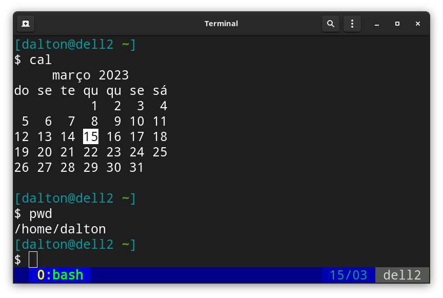
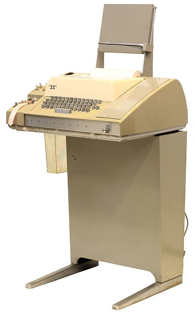
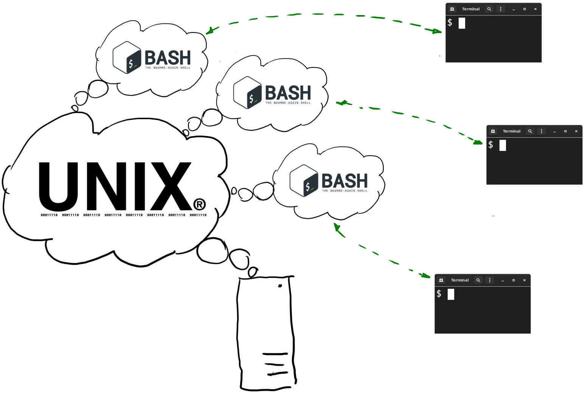

class: center, middle, nonum
# Comandos essencias do Bash

.center[]
### Programação I, Computação@UFCG
©2023 Dalton Serey, UFCG

---
class: greenbar
# Roteiro

Este conjunto de slides é um _roteiro_: uma sequência de
atividades que você (e sua equipe) devem fazer em frente ao
computador, de acordo com cada instrução.

Em cada slide, há a explicação de um conceito, a apresentação de
um novo comando ou uma atividade pra fazer. Só passe de slide,
quando tiver compreendido o conceito apresentado ou quando já
tiver conseguido fazer a atividade proposta.

> .bred[Importante] Várias das atividades planejadas precisam
> ser feitas em um computador Linux nativo e não vão funcionar
> mesma forma em ambientes virtuais ou na _cloud_. Use o LCC!

---
# O Terminal de Caracteres


Um .bblue[terminal] é um equipamento que reúne um
.bgreen[dispositivo de entrada] e um .borange[dispositivo de saída]
pelo qual o usuário pode receber e fornecer dados do/para o
computador. Tipicamente, estamos falando de um .green[teclado] e
um .orange[vídeo]. Atualmente, em geral, também pode incluir um
dispositivo para apontar (_pointing device_), como um
.green[mouse].

O terminal que você usa ao abrir aplicativos em janelas (o
_browser_, por exemplo) está funcionando em .bgreen[modo gráfico].
O que queremos usar, contudo, é o .bblue[terminal de caracteres].

---
# O Emulador de Terminal



Um .bblue[emulador de terminal] é um aplicativo que roda no modo
gráfico que, como diz o nome, .bred[emula] um terminal a caracteres.

Ele nos permite usar ao mesmo tempo o terminal
em modo gráfico e em modo a caracteres, para tirar o melhor
proveito de ambos, simultaneamente.

Sistemas operacionais baseados em Unix, contudo, sempre permitem
que você use o computador, também, no modo terminal a caracteres.

---
class: redbar
## Exercício: usando terminais virtuais

Descubra como alternar do modo
gráfico para o modo de terminal virtual a caracteres. A
maioria das distribuições Linux usa a combinação 
`Ctrl` + `Alt` + `F1` (ou `F2`, ou `F3`, etc) para alternar entre
os terminais virtuais disponíveis.

Observe que ao alternar para um terminal virtual a caracteres, a
tela gráfica é desligada e apenas caracteres são mostrados na
tela do computador. Provavelmente, você verá um _prompt_ para
_login_ que permite que você acesse sua conta pelo terminal.

> Logue-se em um terminal virtual, mas lembre de fechar a sessão
> depois de usá-la. Se você a deixar aberta, outro usuário poderá
> se passar por você.

---
class: redbar
## Exercício: usando um emulador de terminal

Entre no ambiente gráfico. Em seguida,
procure entre os aplicativos disponíveis um
.bgreen[emulador de terminal].

O emulador mais popular é o
`gnome-terminal` que está disponível em toda distribuição Linux
que rode o Gnome. Descubra como executá-lo via mouse e menus. E,
depois, descubra a tecla de atalho que o abre rapidamente pelo
teclado.

> Na maioria das distribuições Linux, a tecla de atalho para
> abrir terminais é `Alt` + `t` ou alguma combinação parecida com
> as outras teclas modificadoras (`Ctrl`, `Shift`, `Fn`, etc).

---
class: redbar
## Exercício: responda

1. O que é um terminal?

2. O que é um terminal virtual no Linux?

3. O que é um emulador de terminal?

4. Qual a tecla de atalho para executar o emulador de terminal na
   distribuição Linux que você usou?

---
# O Shell

Um .bgreen[Shell] é um aplicativo .green[capaz de interpretar comandos]
que o usuário fornece no terminal. Se o terminal é gráfico, os
_comandos_ são os gestos que o usuário faz com o _mouse_ sobre os
elementos mostrados na tela. Se o terminal
é a caracteres, os 
.blue[comandos são palavras da linguagem do shell].

<br> 

> Só por desencargo de consciência. Usamos os termos _aplicativo_
> e _aplicação_ para expressar qualquer _programa_ que executamos no
> computador. Os famosos _apps_ que rodamos em celulares têm seu
> nome derivado dessa palavra (em inglês).

---
# Todo terminal tem um shell

Todo terminal conectado a um computador (seja real ou virtual)
requer que um _shell_ a ele vinculado para que o usuário possa
usá-lo.

No Linux, sempre que você abre um novo emulador de terminal
(perceba que você pode abrir vários ao mesmo tempo) ou quando
você alterna para um terminal virtual (depoois de fazer o login,
claro), o Linux executará automaticamente um shell para interagir
com você através daquele terminal.

<div>&nbsp;</div>

> Se você está usando uma distribuição convencional,
> provavelmente, o shell usado será o Bash.

---
class: redbar
## Exercício: abra um terminal e identifique o shell

Abra um emulador de terminal. Digite o comando `ps` (de _process status_) e
compare a saída obtida com a que é mostrada abaixo.

```bash
$ ps
    PID TTY          TIME CMD
  99448 pts/10   00:00:00 bash
 109739 pts/10   00:00:00 ps
$ _
```

O comando mostra uma listagem dos programas sendo executados
naquele instante (chamados de _processos_). Por _default_, o
comando lista apenas processos vinculados ao terminal em uso (no
exemplo acima, é o terminal `pts/10`, listado na coluna `TTY`).
Observe que há dois processos rodando: um é o `bash` e o outro é
o próprio `ps`. Se você rodar o comando de novo, verá que o
número (`PID`) do _bash_ será o mesmo e o do `ps` terá mudado. Por
quê?

---
# TTY = TeleType



Apenas a título de _cultura Unix_, a coluna `TTY` mostrada na
saída do comando `ps` é um acrônimo do nome da empresa que
fabricava o famoso _TeleType Model 33_ cuja foto mostrei na sala
de aula. O motivo pra isso é que era o terminal típico do PDP-11,
na época em que Ken Thompson e demais criaram o Unix. Até hoje, o
nome interno dos terminais (reais ou virtuais) em sistemas Unix e
derivados usam o termo `tty`.

---
# Máquina + Terminal + SO + Shell (1/2)



---
# Máquina + Terminal + SO + Shell (2/2)

A figura no slide anterior mostra a relação entre os vários
elementos envolvidos dos quais você deve estar ciente.


1. Observe que para cada emulador de terminal rodando há
também um _bash_ rodando
para atender exclusivamente aos comandos que o usuário emitir por aquele
terminal.

2. Todos os comandos, independente do terminal e shell por
que sejam passados, serão executados pelo mesmo sistema
operacional, na mesma máquina compartilhada.

3. O SO atua como "guardião" da máquina. Os shells são
intermediários ou facilitadores para que o usuário use a máquina,
mas isso é feito exclusivamente através do SO.

---
class: middle center greenback
# Comandos Bash

---
# Unix tem manual na própria máquina

Antes de vermos outros comandos, é importante vermos um dos mais
importantes comandos para quem está aprendendo Unix. Me refiro ao
comando `man` (de _manual_), que permite visualizar _páginas do
manual Unix_, diretamente no terminal. Para ver a página do
manual do próprio `man`, por exmeplo, você pode digitar:

```bash
$ man man
```

O comando é um pequeno aplicativo de terminal (que roda conectado
ao terminal até você sair do aplicativo). Os 
principais controles são:

- `q` (_quit_) para sair do manual e voltar ao shell
- teclas para descer e/ou subir
- `/` (seguido de caracteres) pra buscar dentro da página

---
class: redbar
## Exercício: leia páginas de manual

Usando o comando `man`, veja as páginas de manual de todos os
comandos que você já viu em sala de aula ou de outros que você
conheça.

Repare que as páginas têm uma estrutura
parecida, com seções pré-definidas. Acostume-se à
estrutura e aprenda a ler a informação nela contida de forma
eficaz e eficiente.

Dificuldade com inglês? Adicione o
argumento a seguir ao comando, para pedir ao `man` que use
páginas em português (se estiverem instaladas, claro): 

```bash
$ man --locale=pt.br man
```

---
# Argumentos e opções

Um comando pode ou não ter argumentos. Um argumento é um dado
adicional na linha do comando (colocado após o comando)
que permite ajustar o funcionamento do comando.

Por exemplo, o comando `man` sempre requer
um argumento, para indicar a página do manual que se quer ver.
Se for executado sem argumentos, `man`
emite uma mensagem, pedindo o argumento.

> Alguns argumentos podem pedir outros dados, como é o caso
> do `--locale=pt.br` que permite dizer ao `man` em qual linguagem
> queremos a saída. Tais argumentos são chamados de opções. Se
> você trocar o `pt.br` por `fr` ou `it`, por exemplo, poderá ver
> o manual em francês ou italiano.

---
# Manipulação do sistema de arquivos

O shell permite criar e apagar arquivos e diretórios, tal como as
interfaces gráficas convencionais às quais você deve estar
acostumado. Vejamos logo, uma listagem dos principais comandos
para navegar e manipular o sistema de arquivos do computador.

1. `ls` (_list_) imprime o conteúdo de um diretório
2. `pwd` (_print working directory_) imprime o diretório atual do shell
3. `cd` (_change directory_) muda o diretório atual do shell
4. `rm` (_remove_) apaga um arquivo
5. `mkdir` (_make directory_) cria um novo diretório
6. `rmdir` (_remove directory_) apaga um diretório vazio

---
class: redbar
# Exercício: explore o sistema de arquivos

No terminal, digite o comando `cd /`, para fazer o shell mudar o
diretório de trabalho para a raiz do sistema. Usando o comando
`ls`, liste o conteúdo do diretório. Veja quantos arquivos e
diretórios diferentes há no diretório raiz.

Estude a saída do comando `ls` (use o `man` se necessário). Se o
shell estiver configurado, a saída será colorida, com
diretórios e arquivos normais tendo cores
diferentes.

Entre nos diretórios `/bin`, `/etc`, `/lib` e veja o que há em
cada um deles. Em alguns, você encontrará os
comandos, em outros os aplicativos instalados e até o
arquivo de usuários e senhas.

Ah, não se preocupe: não dá pra quebrar nada, só navegando pelo
sistema, como estamos fazendo.

---
class: redbar
# Exercício: ache os diretórios de usuários

Os diretórios dos usuários do sistema são armazenados no
diretório `/home`, em um subdiretório com igual ao nome do
usuário. Por exemplo, meu diretório pessoal no sistema é
`/home/dalton`.

Navegue para o diretório `/home` e liste os diretórios ali
existentes. Perceba que cada um deles corresponde a um usuário do
sistema.

Tente navegar para dentro do diretório pessoal do usuário. Vários
sistemas Unix permitem isso livremente, mas até certo nível.
Outros proibem até a listagem do diretório base dos outros
usuários.

---
# Criação de diretórios

Novos diretórios podem ser criados com o comando `mkdir`. Ele
requer o nome do novo diretório como argumento. Em geral, o novo
diretório será criado no atual diretório de trabalho do shell.

Para criar um diretório em outro lugar, você deve _navegar_ pelo
sistema de arquivos e diretórios para o diretório dentro do qual
deseja criar o novo diretório e deve executaro o comando
`mkdir` dentro dele. 

---
class: redbar
# Exercício: crie diretórios em seu home

Em seu diretório _home_, crie uma estrutura de
diretórios igual à mostrada abaixo. Use os comandos
`cd` para navegar; `pwd` para identificar o
diretório corrente do shell, se necessário;
`mkdir` para criar diretórios; e `rmdir` para apagar diretórios
criados errado.

```
$ tree -d
disciplinas/
├── fmcc
│   ├── arquivos
│   └── exercicios
├── ic
│   ├── arquivos
│   ├── exercicios
│   │   ├── ex1
│   │   ├── ex2
│   │   └── ex3
│   └── provas
├── lpt
└── p1
```

---
class: redbar
# Exercício: use o tree

O comando `tree` não é padrão e pode não estar instalado em sua
máquina (ou no LCC). Mas, se estiver, é muito útil, para
visualizar a árvore de diretórios e arquivos no terminal. Veja se
o `tree` está instalado em sua máquina. 

Por _default_, o `tree` mostra diretórios e arquivos. Mas, em
geral, é preferível ver apenas diretórios. Para isso, use a opção
`-d`.

---
class: redbar
# Exercício: crie diretórios fora do home

Sistemas Unix protegem o sistema de arquivos para evitar que o
usuário "mexa" onde não deve. Se você tentar criar diretórios em
locais fora do seu _home_, provavelmente, você não vai conseguir.

> Se você conseguire é por um de dois motivos: i) ou o sistema
> está sendo mal gerenciado e o super-usuário não percebeu que
> configurou mal as permissões do seu usuário (ou talvez de todos
> os usuários); ou ii) você está em um diretório fora do _home_
> em que, na verdade, seu usuário deve ter permissão mesmo para
> criar diretórios. Um diretório em que isso deve ocorrer é o
> `/tmp` que é usado justamente para criar diretórios e arquivos
> temporários.

---
# Arquivos de dados

Em geral, arquivos de dados não são criados manualmente pelo
usuário com comandos diretos no shell. O mais convencional é que
o usuário use algum aplicativo para criar os arquivos: um editor
de textos para criar arquivos com texto; editores de imagens,
para criar arquivos de imagens; e assim por diante.

Aqui e agora, contudo, vamos criar apenas arquivos bem básicos.
Mostrarei comandos para criar arquivos contendo apenas umas
linhas mínimas de texto, de forma que sequer usaremos um editor.
Faremos tudo da linha de comando. Da mesma forma, veremos dois
comandos importantes que permitem visualizar o conteúdo de
arquivos de texto.

---
# Listando arquivos

O comando `cat` permite imprimir o conteúdo de arquivos (de
texto) diretamente no terminal. O programa apenas imprime todo o
texto e termina, retornando ao shell. Observe que não se trata de
um editor. Serve apenas para investigar rapidamente o conteúdo de
um arquivo.

---
class: redbar
# Liste o `/etc/passwd`

O arquivo `/etc/passd` é o local historicamente usado em sistemas
Unix para armazenar os usuários dos sistema (originalmente,
também armazenava as senhas criptografadas, mas atualmente, isso
não é mais feito). 

Na linha de comando, use o comando `cd` para navegar até o
diretório `/etc` e, em seguida, use `cat` para listar o conteúdo do
arquivo. Veja o conteúdo de outros arquivos ali contidos.

---
# O Comando `less`

Um outro comando bastante útil para listar o conteúdo de arquivos
de texto é o `less`. Ele é semelhante ao `cat`, mas tem a
vantagem de pausar a listagem quando a tela fica cheia. Quando
isso ocorre, `less` permite que o usuário use as teclas para
visualizar a parte mais abaixo (ou acima) do arquivo. Para sair,
use a tecla de controle `q` (tal como com o comando `man`).

> Experimente o comando `less` com os demais arquivos presentes no
> diretório `/etc`.

---
# O Comando `echo`

Apesar do nome estranho, o comando `echo` é bem simples de
entender. Ele apenas imprime a mensagem que for passada como
argumento ao comando. Por exemplo, o comando abaixo imprime a
mensagem `Oi, mundo!` no terminal.

```bash
$ echo Oi, mundo!
Oi, mundo!
$ _
```

> Teste o comando acima em um terminal.

---
# Redirecionando saída para um arquivo

O resultado impresso por um programa é sempre chamado de _saída_.
No slide anterior, por exemplo, o comando `echo` produz uma saída
igual ao argumento.

Sistemas Unix têm uma forma clássica de variar o comando para que
o shell .bgreen[redirecione] a saída do programa executado para
um arquivo ao invés de imprimi-la no terminal. Ao invés de
conectar o programa ao terminal, o shell o conecta a um arquivo.
Assim, a saída fica gravada em disco ao invés de ficar
apenas no terminal. Para isso, usamos o operador `>` ao final do
comando, seguido do nome do arquivo.

```bash
$ echo Oi, mundo! > ola.txt
$ _
```

---
class: redbar
# Exercício: crie um arquivo

Em seu diretório home, crie o arquivo `meu-nome.txt`, contendo
apenas seu nome completo. Para isso, use o comando `echo` e o
operadore de redirecionamento para arquivos `>` visto no slide
anterior.

Em seguida, liste o conteúdo do arquivo criado no terminal,
usando o comando `cat`.

Rode o comando `echo` uma segunda vez, usando um nome diferente.
Em seguida, rode o comando `cat` para listar o conteúdo. Observe
que o conteúdo original foi perdido e substituído pelo novo.

---
# Redirecionamento acumulativo

Sistemas Unix permitem uma segunda forma de redirecionar a saída
de comandos para arquivos, usando o operador `>>`. Este operador
é semelhante ao anterior. Mas, ao contrário dele, não sobrepõe o
conteúdo existente. Ele apenas adiciona o novo conteúdo ao final
do arquivo (caso ele exista, claro).

```bash
$ echo Oi, mundo! > ola.txt
$ echo Linha 2 >> ola.txt
$ echo Linha 3 >> ola.txt
$ cat ola.txt
Oi, mundo!
Linha 2
Linha 3
$ _
```

---
class: redbar
# Exercício: crie um arquivo com 3 linhas 

Usando o comando `echo` e o operador de redirecionamento
acumulativo `>>`, crie o arquivo `texto.txt` no subdiretório
`ex3` da estrutura de diretórios criada anteriormente, contendo
apenas três dados pessoais seus: sua matrícula na primeira linha;
seu email institucional na segunda linha; e seu nome completo na
terceira linha.

---
# Python

Para terminamos o roteiro de hoje, vejamos como entramos no shell
de Python. Lembre: um shell é apenas um programa que faz a
intermediação entre um usuário em um terminal e o SO +
computador. Python tem um modo shell em que ele toma conta do
terminal e nos permite digitar comandos diretamente na linguagem
Python. O comando para iniciar o shell Python, a partir do shell
Bash é: `python`.

> **Importante** Lembre que ao estar usando o shell Python, você
> não pode mais usar os comandos do Bash e vice versa. Se você
> precisa de ambos simultaneamente, abra dois terminais e tenha
> um deles rodando Python e outro rodando o Bash.

---
# Python vs Bash

De modo geral, toda linguagem de programação pode fazer o mesmo
que qualquer outra. A questão é com que eficiência e simplicidade
cada linguagem faz cada coisa. É por isso que precisamos de
várias linguagens. Bash é uma linguagem para a operação do SO +
computador. Já Python é uma linguagem para programar aplicações.

Poderíamos usar Python para criar diretórios e arquivos como
fizemos com Bash. Sim, podemos, mas seria bem mais complicado e
trabalhoso. Da mesma forma, também podemos programar um
aplicativo web completo, usando Bash. Mas seria bem mais
complicado do que fazê-lo, usando Python.

---
# Python como calculadora

Por ora, o foco é o uso de Bash e a operação do computador, do
sistema operacional e do sistema de arquivos. Nesse sentido,
Python, ainda pode ser uma excelente ferramenta no dia-a-dia, no
terminal. Use o shell Python como calculadora.

Para isso, rode um shell Python e digite expressões diretamente.
O shell Python interpretará as expressões imediatamente,
impimirá o resultado das operações e voltará a emitir o prompt,
para ficar à espera de novo comando.

> Acostume-se a usar o shell Python como calculadora. Mais
> adiante, você passará a usá-lo o tempo inteiro para explorar
> ideias de programação, antes de escrevê-las em arquivos.
