class: center, middle, nonum
# Computador, Terminal, S.O. e Shell
### (Por que saber usar o terminal é importante?)

 
 
 
©2022 Dalton Serey, Programação I, Computação@UFCG

---
class: center middle
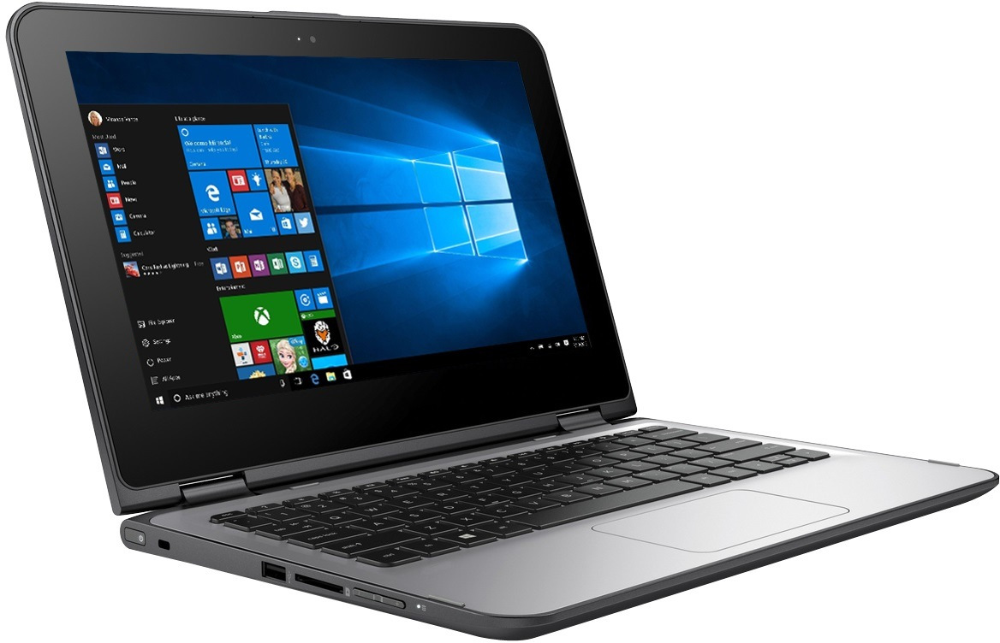

---
class: center middle
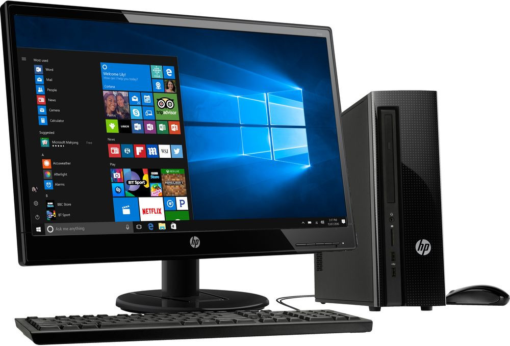

---
class: center middle
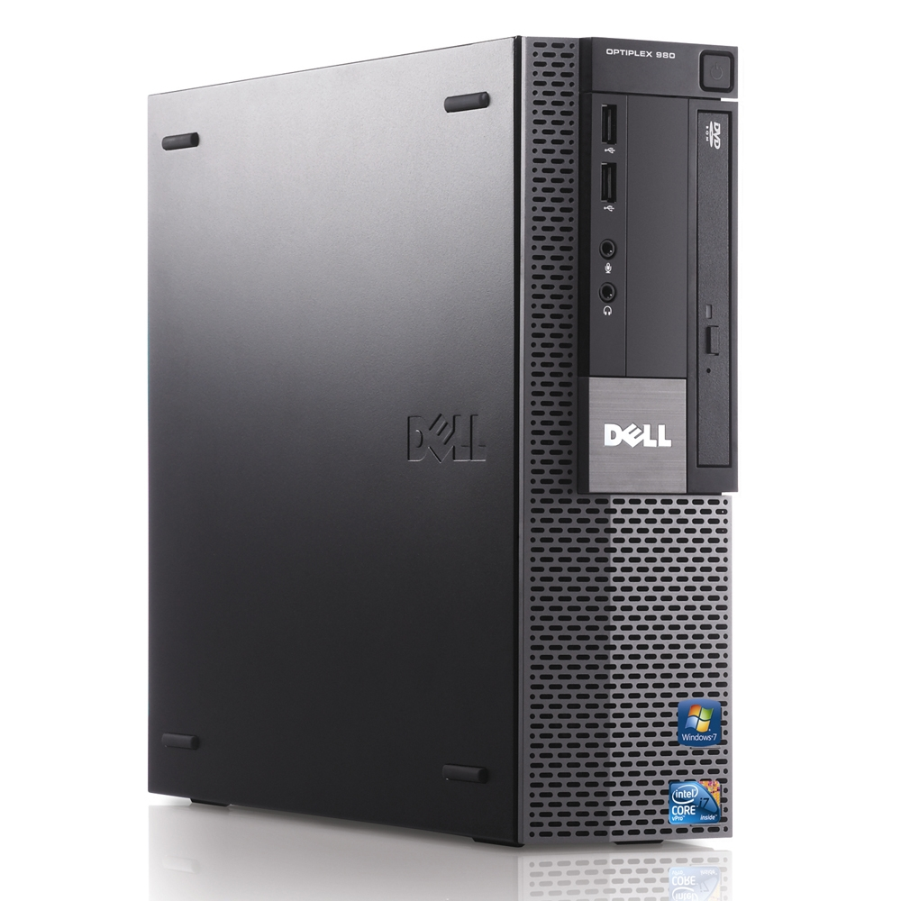

---
class: center middle
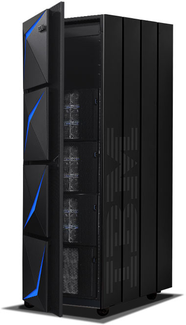

---
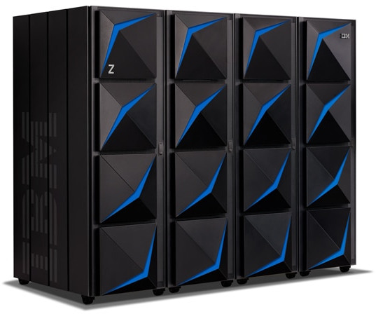

---
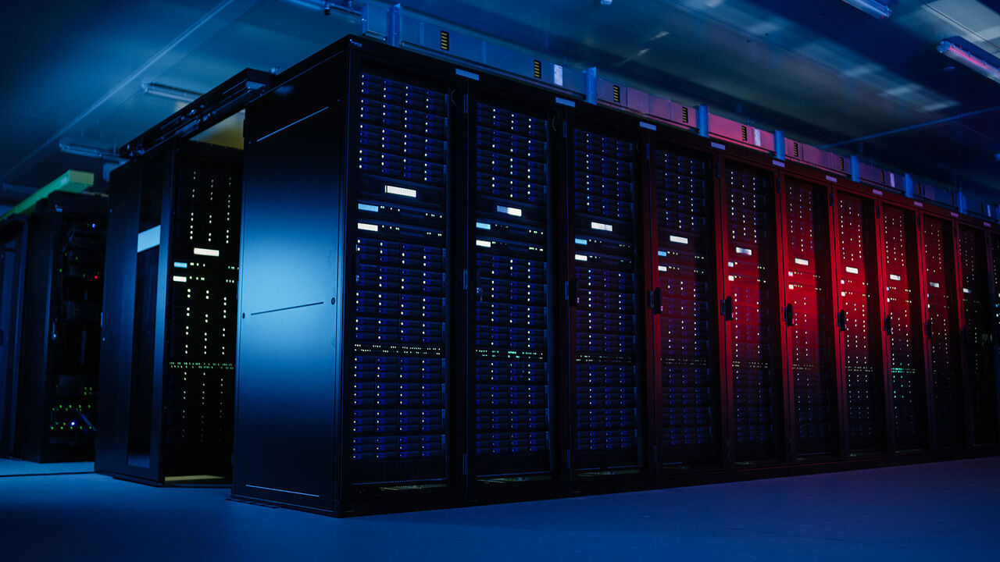

---
class: middle center secao-blue

# Terminais

---
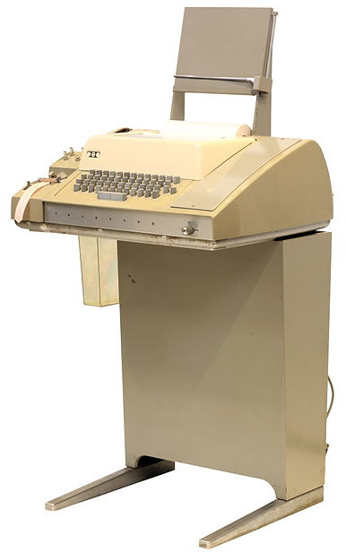
# Terminais

O equipamento clássico para uso remoto do computador é o
.blue[terminal]. Combinavam teclado, equipamento
para ler e perfurar fitas e para imprimir em
papel (formulário contínuo).

Este é o _histórico_ .bred[Teletype Model 33], de 1963. Por
sinal, o primeiro a usar o famoso código ASCII (que, na época,
tinha acabado de ser criado).

A fabricante .bgreen[Teletype] foi tão importante, que o nome é
sinônimo de terminais deste tipo até hoje.

---
# Para o curioso

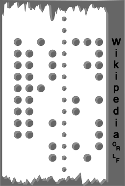
- vídeo de uma [Model
  33](https://youtu.be/S81GyMKH7zw?t=184) recuperada
     e funcionando
- ao lado, imagem de fita perfurada com a
  string `Wikipedia\r\n` em ASCII

---
class: center
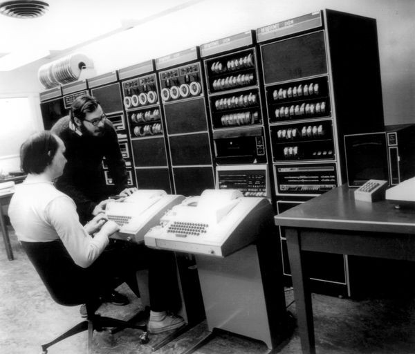

Ken Thompson e Dennis Ritchie na Bell Labs, usando um PDP 11
através de dois terminais Teletype Model 33 (época em que criaram
Unix e C).

---
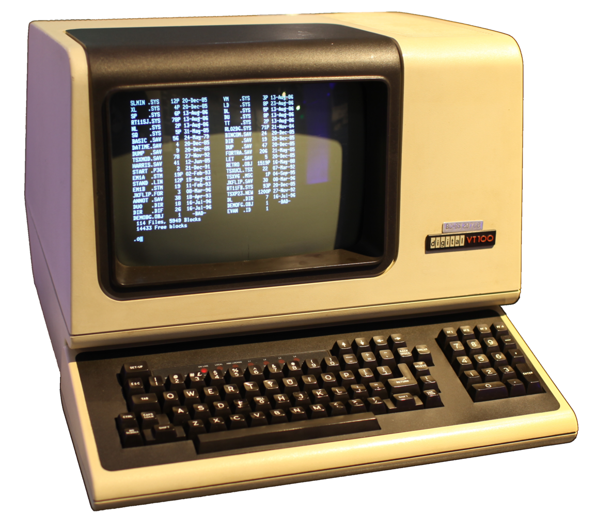

# Terminais de vídeo

Este é outro terminal _histórico_: o .bred[VT100]. Embora pareça
um computador, é apenas um terminal.

Por ser muito mais rápido, por permitir poupar bastante papel e
por introduzir os famosos .bblue[códigos] .bblue[de escape]
.bblue[ANSI] para controlar o cursor, estilizar texto, e outras
opções de vídeo, o VT100 substituiu completamente o _teletipo_.

> Sobre ser econômico, perceba que usar o _teletipo_ requeria
> muito papel, porque toda sessão de uso precisava ser
> impressa, já que era a única forma de comunicação com a máquina.

---
# Aplicações de terminal de vídeo

As aplicações de terminais teletipo precisam ser orientadas
ao modelo conversacional imposto pela forma de interação.

O terminal de vídeo, o VT100 e os códigos de escape ANSI permitem
uma nova forma de interação: visual.

- ed (ex) X vi
- bastet
- myman
- ascii-patrol

---
class: term center middle

# Shells

---
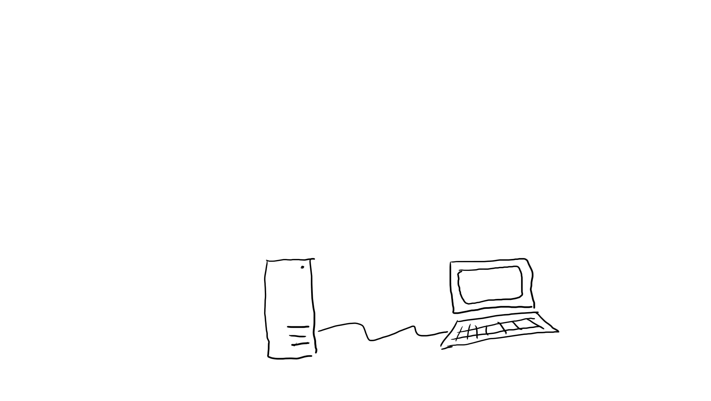

???

Vejamos uma configuração convencional de um computador e seu
terminal. Terminais se ligam fisicamente ao computador.

---
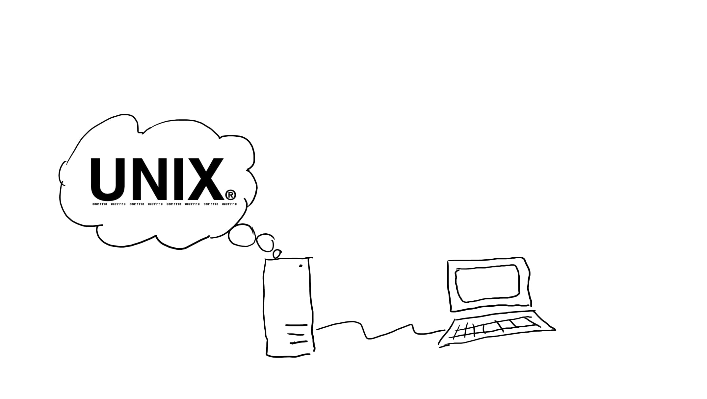

???

Contudo, como seria extremamente inconveniente conversar na
linguagem de máquina diretamente, precisamos de uma camada de
softwate. É aí que entra o Sistema Operacional (SO). Um SO
proporciona uma camada de abstração e serviços mais abstrata e
conveniente tanto para o usuário humano (seja o programador ou
um usuário final), como para um outro software. Graças ao SO, as
aplicações não precisam saber como lidar com dispositivos de
disco, memórias SSD, placas de rede diversas, etc. O SO fornece
um serviço simplificado para todos esses dispositivos.

Para o terminal, não é diferente, já que é um dispositivo de
entrada/saída. Embora, fisicamente, o computador seja diretamente
conectado ao terminal, todo seu funcionamento é controlado pelo SO.

---
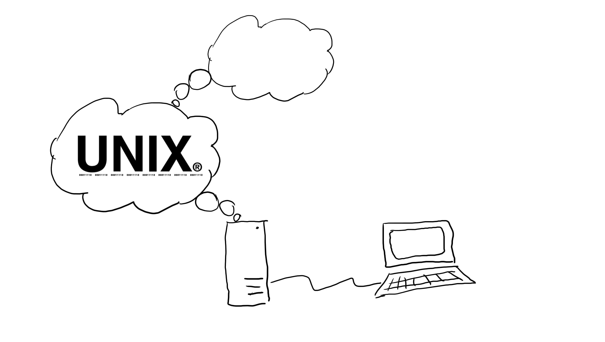

???

Já para conversar com o usuário que ficará por trás do terminal,
o SO destaca um outro software (um utilitário), chamado, de forma
genérica, de _shell_. Assim, o _shell_ é um software que atua
como intermediário entre um terminal e o sistema operacional,
através do qual o usuário pode usar o SO e a máquina. Todos nós
usamos _shells_ diariamente se usamos computadores... os _shells_
modernos e mais conhecidos são mais voltados para o usuário final
do computador do que para o programador e por isso são gráficos e
orientados a gestos e conceitos abstratos como janelas, ícones,
botões, etc. O Windows, o gnome-shell, o sistema gráfico do MacOs
são exemplos de _shells_.

---
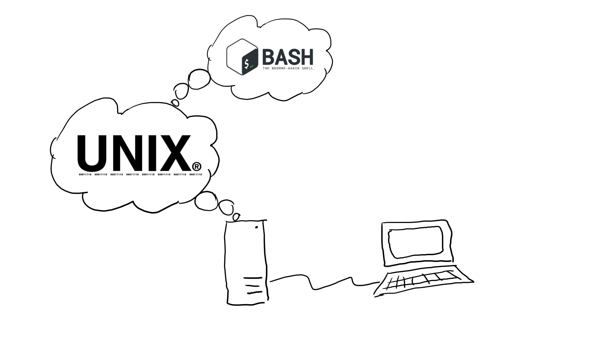

???

Os shells gráficos, contudo, apesar das vantagens para o usuário
final tem várias desvantagens para o uso mais técnico. Eles
escondem o verdadeiro funcionamento do sistema por trás das
abstrações. Também tornam os processos significativamente mais
lentos. E dificultam a reutilização e customização dos processos,
porque não são orientados a linguagem, mas a gestos.

É aí que os _shells textuais_ brilham. Um shell textual é menos
amigável que um shell gráfico, mas é orientado a linguagem e, por
isso, tende a ser muito mais rápido porque requer menos memória e
cpu para operar. Além disso, são naturalmente programáveis.
Comandos usados no terminal podem ser armazenados em arquivos
(_scripts_) e executados automaticamente de forma semelhante a
programas convencionais.

A linguagem específica de _shell_
textual que usaremos no curso é o _Bash_.

---
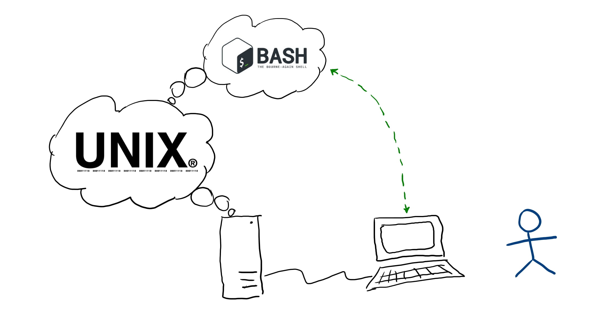

???

Um aspecto importante a perceber: o usuário interage com o
computador (CPU, memória, dispositivos de E/S), através do
terminal, do shell e do SO. Comandos digitados no terminal, são
interpretados pelo _shell_. E quando o _shell_ precisar executar
programas, aplicativos ou usar alguma coisa a mais da máquinas,
ele só poderá fazer isso com o apoio do SO que, por sua vez,
usará a máquina.

> Importante: como o significado mais técnico da palavra
> _shell_ é pouco conhecido de quem não é da área de computação e
> sistemas operacionais, em geral, quando usamos a palavra
> .bblue[_shell_] quase sempre estamos nos referindo a
> .bgreen[_shell_ textual].

---
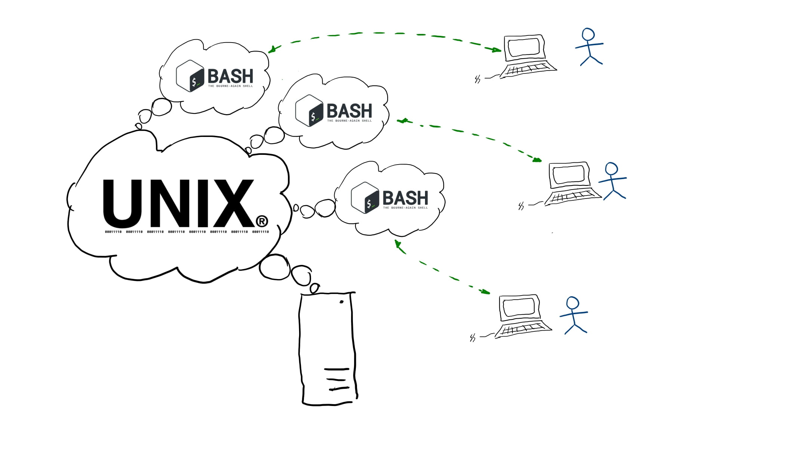

???

Um aspecto importante a destacar é que quando há múltiplos
terminais ligados ao computador, o sistema operacional deve criar
um número igual de _shell_ para interagir com os terminais. Isso
garante que cada um deles terá um contexto completamente
independente.

---
# Os terminais modernos

Hoje, usamos .bblue[emuladores de terminal]: _softwares_ que
emulam (se comportam de forma idêntica a) terminais físicos.

Por ter introduzido ideias importantes, o .bgreen[VT100] é
provavelmente o tipo de terminal mais emulado pelos softwares
emuladores de terminal (embora não seja o único).

???

A verdade é que o tempo dos .bblue[terminais] físicos acabou.
Desde a criação dos computadores pessoais (PCs), a criação de hardware
específico para atuar como terminal praticamente desapareceu,
graças ao uso de _emuladores de terminal_. 

E as vantagens são inúmeras. Um único PC pode emular praticamente
qualquer tipo de terminal, de qualquer fabricante. De fato, um PC
pode emular vários terminais simultaneamente (do mesmo tipo ou de
tipos diferentes). Algumas limitações físicas podem facilmente
ser ignoradas (terminais a caracteres podem ter dimensões
virtuais praticamente ilimitadas, por exemplo). Sessões de uso
podem ser armazenadas e reiniciadas em momentos diferentes e até
a partir de locais diferentes.

---

???

Diante disso, podemos redesenhar nossa figura final da
organização de uso de um sistema Unix por terminais. Embora
terminais não existam mais, a mesma organização pode e é
utilizada para permitir o uso de emuladores de terminal.

---
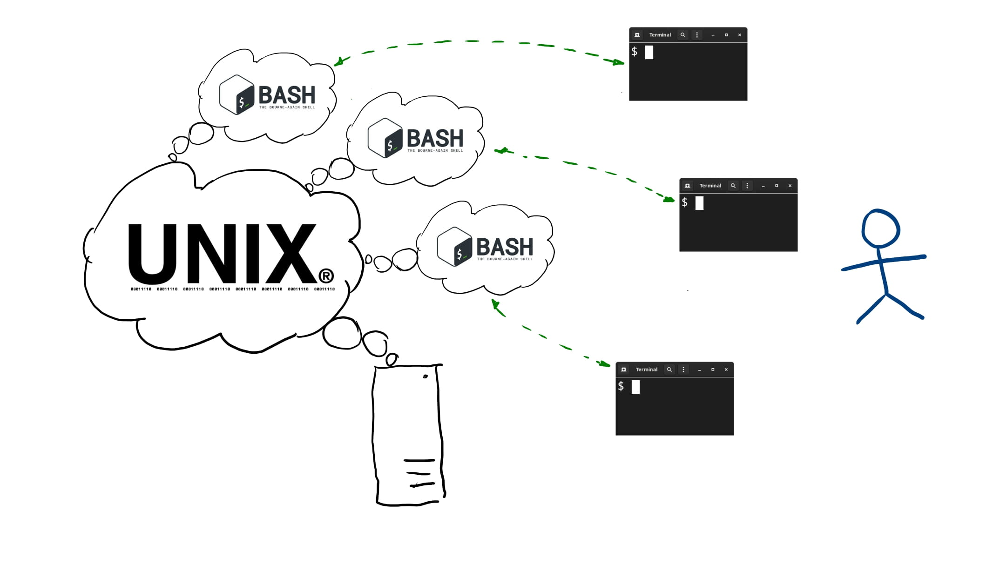

???

E isto dá o uso típico de um sistema Unix por um desenvolvedor.
Ele terá, tipicamente, vários (emuladores de) terminais
executando simultaneamente, cada um com seu próprio processo
shell executando o Bash (ou até outro shell simultaneamente). De
fato, é comum que alguns desses terminais estejam conectados a
diferentes computadores, através da Internet.

Essa organização dá muito mais agilidade ao usuário porque
permite que explore melhor a capacidade das máquinas, fazendo
atividades simultaneamente e/ou multi-camadas, sem precisar
interromper uma sessão para fazer outra. Quando o usuário precisa
de uma nova sessão, basta que inicie um novo emulador de
terminal, com um novo _shell_ e use a nova sessão para a nova
atividade. Quando a atividade for encerrada, pode simplesmente
fechar o terminal e retomar a atividade anterior.

---
# Bash = Bourne Again Shell

O Bash (ou .bblue[Bourne Again Shell]) é o _shell_ textual padrão
na maioria dos sistemas operacionais POSIX ou baseados em Unix,
tais como Linux, MacOs, Solaris, HPUX, etc. Foi criado por 

>  src="imagens/the_unix_programming_environment.jpg" width="36%">
> O nome é uma brincadeira
> com o nome do autor do _shell_ mais famoso do Unix original conhecido
> como o .bgreen[Bourne Shell] (o famoso `sh`), 
> Stephen Bourne.
>
> O `sh` ficou especialmente famoso por ser o
> tema do primeiro livro comercial de 
> programação com _scripts shell_ (escrito por ninguém menos que
> Brian Kernighan e Rob Pike). .bred[Recomendado!!!]

---
# Exercício

1. Identifique no seu Linux como iniciar um (emulador de)
   terminal
2. Crie um ícone no seu desktop ou barra de ferramentas para
   poder criar novos terminais facilmente.
3. Descubra se há alguma tecla de atalho para iniciar novos
   terminais (no meu Linux, é `alt-t`).
4. Descubra se há teclas de atalho para reposicionar a tela do
   terminal (ou qualquer aplicativo) de forma mais confortável
   para o trabalho (aprenda esses atalhos!)
5. Pressione `ctrl-d` para sair do terminal (esse é um código
   ANSI quase universal para indicar que você concluiu o uso de
   um _shell_).
