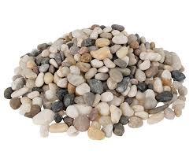
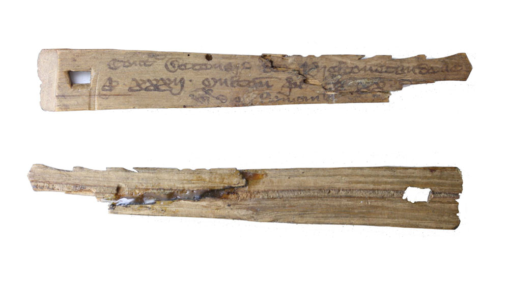
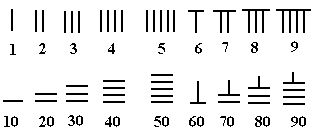
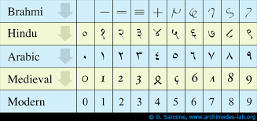
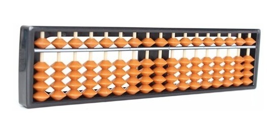
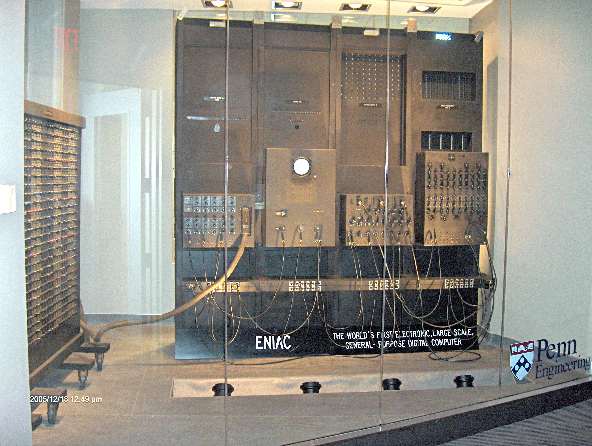
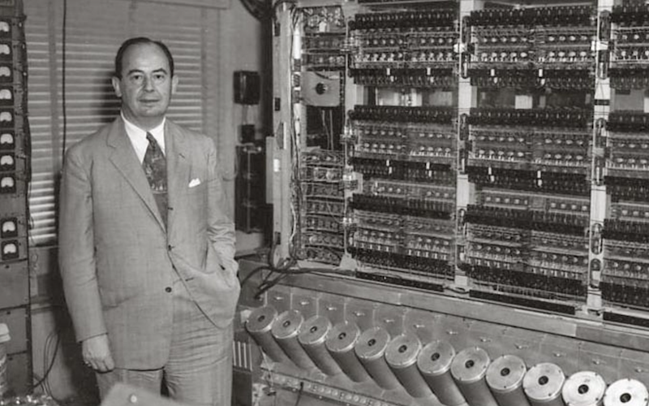
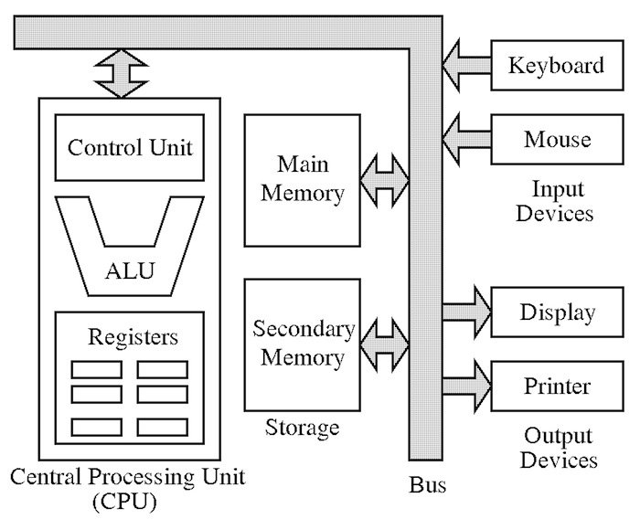
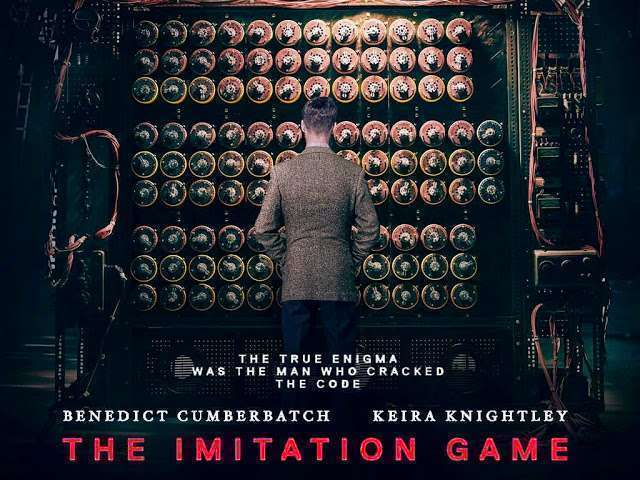

class: center, middle
# Computadores e Programação
## Programaçao I

 
 
 
©2020 Dalton Serey, UFCG

---
class: center, middle

# O problema fundamental é .green[contagem]

--

### Mais especificamente: como contar, sem perder a conta

---
class: center, middle

---
class: center, middle

---
class: center, middle

.bred[CALCULUS]latin = .bblue[PEDREGULHO]português

---
class: center, middle

---
class: center, middle

---
class: center, middle

---
class: center, middle

---
class: center, middle

---
class: center, middle

---
class: center, middle

---
class: center, middle

---
class: center, middle

### Computador moderno = programa + dados

### ambos na memória

---
class: center, middle

---
class: center, middle

---
class: center, middle

---
class: center, middle

---
class: center, middle

